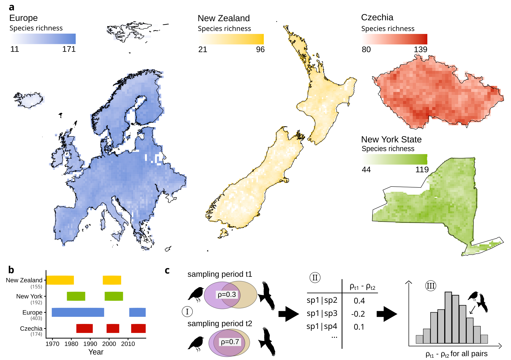

# cooccurrences

Studies of biodiversity dynamics in recent decades have shown changes in community composition, yet the exact nature of how species assemblages change remains unclear. Given the commonly observed temporal community composition turnover and environmental changes, we expected to see changes in the spatial associations among species. 
Focusing on birds, we analyzed spatial associations (co-occurrences) among species pairs using four independent, large-scale, long-term datasets covering Czechia, Europe, New York State, and New Zealand. Each dataset spans an average duration of 30 years, offering a unique temporal view on co-occurrence patterns. 
Surprisingly, we found that large-scale bird co-occurrence patterns remained remarkably stable through time. Changes in spatial associations lacked any average directional trend and did not correspond with species’ phylogenetic or functional distances, nor with shifts in their range sizes. There was mild evidence for changes towards more aggregation in aquatic species. In addition to small quantitative changes in co-occurrences of species pairs, the composition of typically co-occurring  species showed little change over time as well. 
Overall, our data show that most species maintain their spatial associations over decades, suggesting that co-occurring species show comparable reactions to environmental changes. Exploring how this stability in co-occurrence patterns aligns with previously observed temporal community composition turnover could be an exciting direction for future work.

[link to manuscript](https://docs.google.com/document/d/1KR0dv7v_4Ajuaas5ygwyHME2rlHCxMAXGSAvvIH5wig/edit?tab=t.0) 

